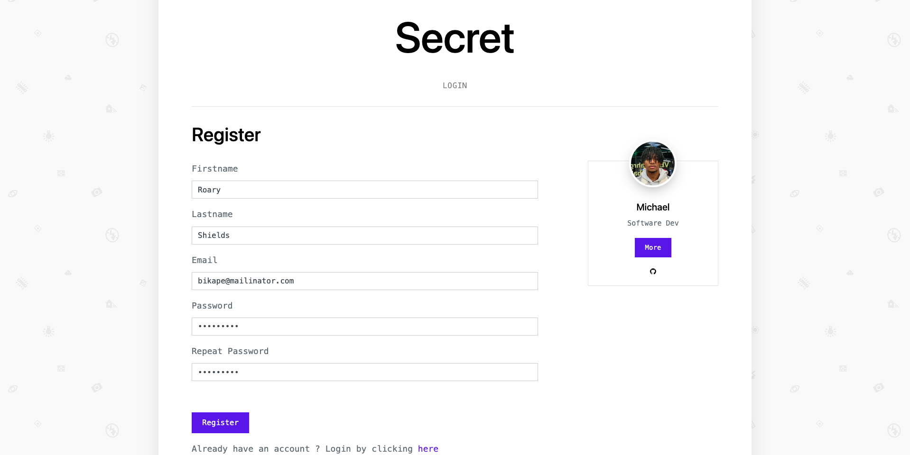
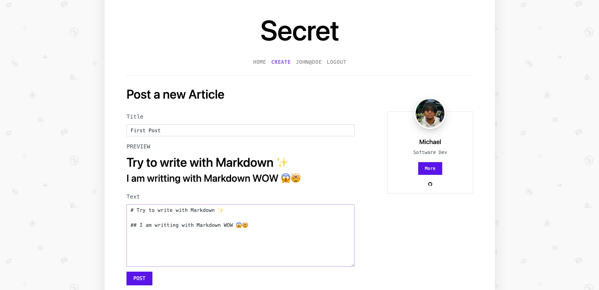
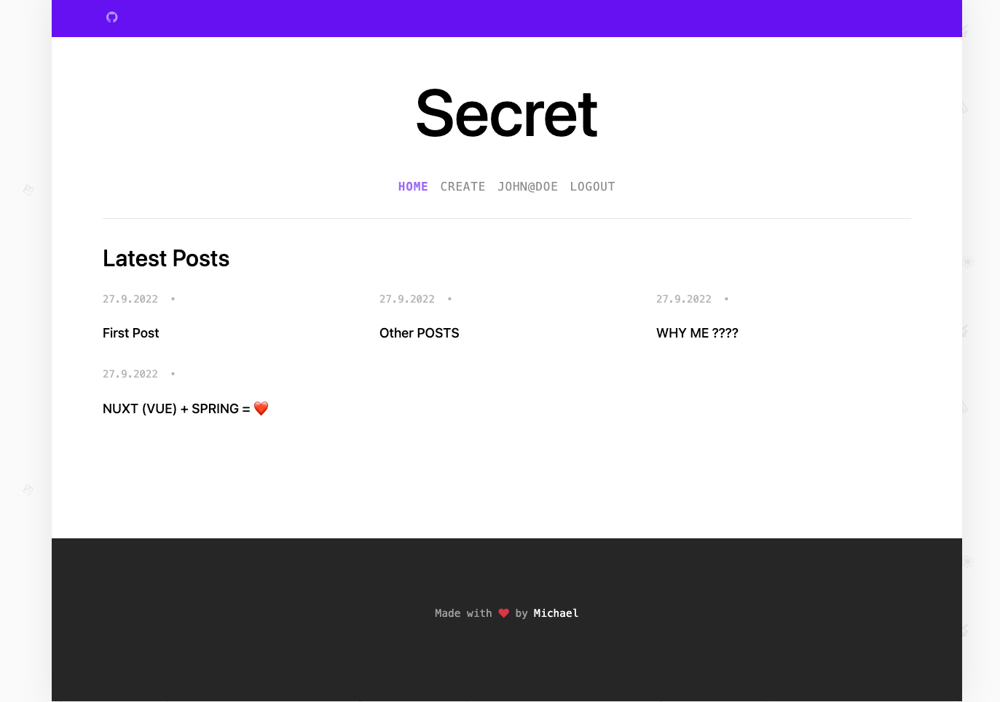

# Secret  🔐 (Small blog like web app to keep your notes secret 🤫)
This application is a project set up to apply my knowledge of Nuxt.js and 
refresh my knowledge of REST API development with Spring Boot.

## Setup
Clone this repository and make sure to install the dependencies:

### Frontend 
Go to frontend and run : 
```bash
# yarn
yarn install

# npm
npm install

# pnpm
pnpm install --shamefully-hoist
```

Start the development server on http://localhost:3000

```bash
npm run dev
```


### Backend 

Install Gradle Dependency and Run the main Java Class : **SecretApplication.java**

## Features 

- AUTH FUNCTIONALITIES (Login / Logout / Register)



- CREATE / DELETE / EDIT <- (coming soon ...) ARTICLES 



- See your articles 



Thank you for reading and dont forget to give a star ... ⭐️